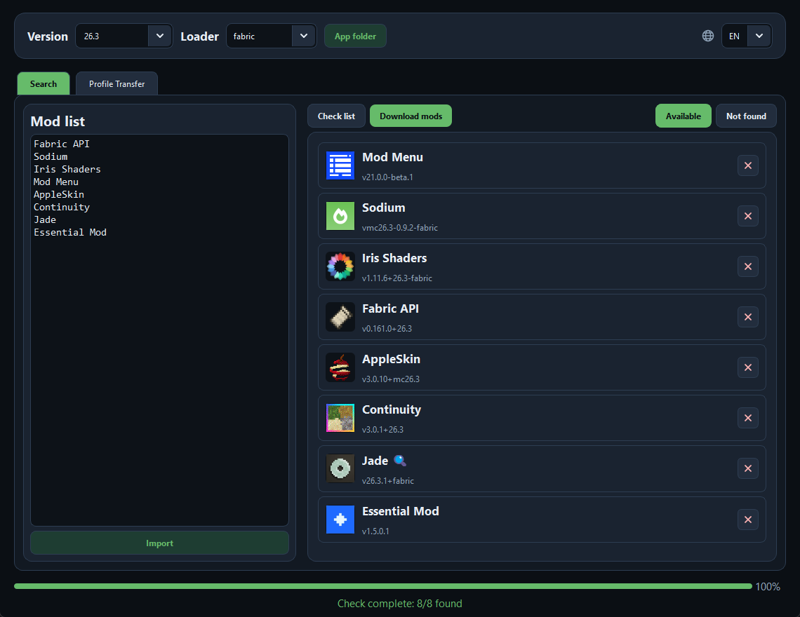
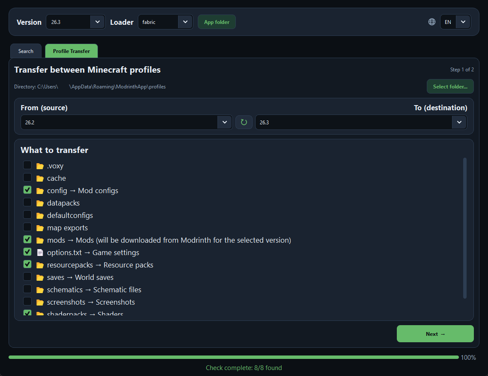
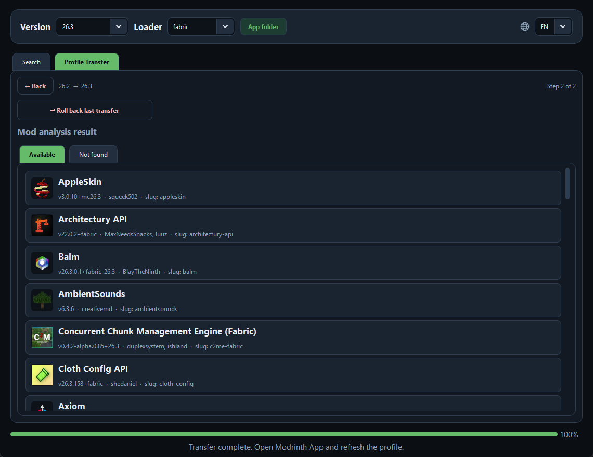

<p align="center">
  
</p>

# ModBridge

<p align="center">
  <a href="README.ru.md">Читать на русском</a>
</p>

Desktop app for finding and downloading Minecraft mods via the [Modrinth](https://modrinth.com) API,
as well as transferring data between Minecraft profiles of any launcher. UI in Russian and English.

## Screenshots





## Download

Ready-made builds are published on the [Releases page](https://github.com/WoolfinDev/ModBridge/releases):

- Windows: `ModBridge.exe` — download and run, no install needed.
- Linux: `ModBridge` — `chmod +x ModBridge && ./ModBridge`,
  or `sh packaging/build_linux.sh --install` for a menu shortcut.

No account, no API key — the app uses the public Modrinth API.

## Features

- **Search** — check a mod list against the target Minecraft version and loader
  (`fabric`, `forge`, `neoforge`, `quilt`), download in one click.
- **Import** — recognize mod names from a folder of `.jar` files (by Modrinth hash or in-jar metadata).
- **Profile transfer** — copy `mods`, `resourcepacks`, `config`, `shaderpacks`, `saves`, etc.
  between profiles of any launcher (Modrinth App profiles are auto-detected, any custom
  folder can be picked manually). Mods are re-downloaded from Modrinth for the target version,
  a backup with one-click rollback is created before transfer (last 5 backups are kept,
  rollback removes files the transfer added and restores overwritten ones).
- **RU/EN** — language switch at the top right, choice is saved.

## Install & run (from source)

Requires Python 3.10–3.11 (`PySide6==6.5.2` in `requirements.txt`).

Windows:

```bash
pip install -r requirements.txt
python main.py
```

Linux (on Debian 12+ the system pip is locked, so use a venv;
the system libs below are required to *run* PySide6):

```bash
sudo apt install python3-venv libgl1 libegl1 libfontconfig1 \
  libxkbcommon-x11-0 libdbus-1-3 libxcb-cursor0  # Debian/Ubuntu

python3 -m venv .venv
.venv/bin/pip install -r requirements.txt
.venv/bin/python main.py
```

## Build

Windows (PowerShell, recommended):

```powershell
powershell -ExecutionPolicy Bypass -File packaging/build_windows.ps1
# -> dist/ModBridge.exe
```

Manual alternative:

```powershell
pip install pyinstaller
pyinstaller --noconfirm --onefile --windowed --name ModBridge `
  --icon assets/icon.ico `
  --add-data "modrinth_app/locales;modrinth_app/locales" `
  --add-data "assets;assets" `
  main.py
```

Linux:

```bash
sh packaging/build_linux.sh            # build only -> dist/ModBridge
sh packaging/build_linux.sh --install  # build + install into ~/.local
```

Translations live in `modrinth_app/locales/` — they must be
bundled via `--add-data`, otherwise the build will start with raw keys instead of texts.

## Where files go

- Downloaded mods: `mods_<time>-<mc-version>/` next to the app when run from source,
  otherwise in `Downloads` (Windows picks a writable folder automatically).
- Settings: `config.json` next to the code when run from source,
  otherwise `%LOCALAPPDATA%/ModBridge/config.json` (Windows)
  or `~/.local/share/ModBridge/config.json` (Linux). Not committed.
- Transfer backups: `.transfer_backups/` (same fallback logic as settings). Not committed.

## Structure

```
main.py                  # entry point
modrinth_app/
    app.py               # GUI (PySide6)
    api.py               # Modrinth API client
    resolver.py          # matching mods to Modrinth projects
    jar_metadata.py      # reading metadata from .jar
    localization.py      # translation loading
    locales/             # ru.json, en.json
    constants.py         # theme, fonts, transfer rules
    utils.py             # paths, safe download, filename helpers
    _version.py          # single source of app version
    services/            # transfer, check, import, backups
packaging/
    build_windows.ps1    # Windows build
    build_linux.sh       # Linux build + install
    ModBridge.desktop    # Linux menu entry
assets/                  # icon + UI glyphs (committed)
config.json              # user settings (not committed)
.transfer_backups/       # transfer backups (not committed)
```

## License

MIT — see [LICENSE](LICENSE).
